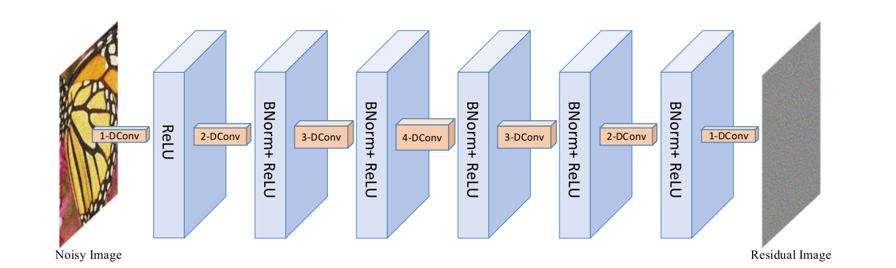
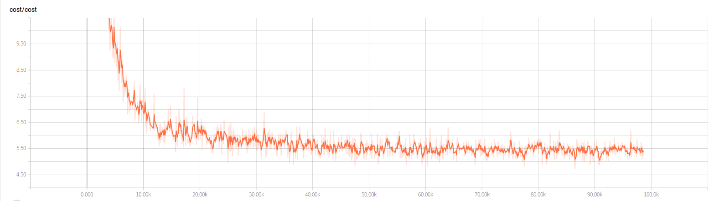
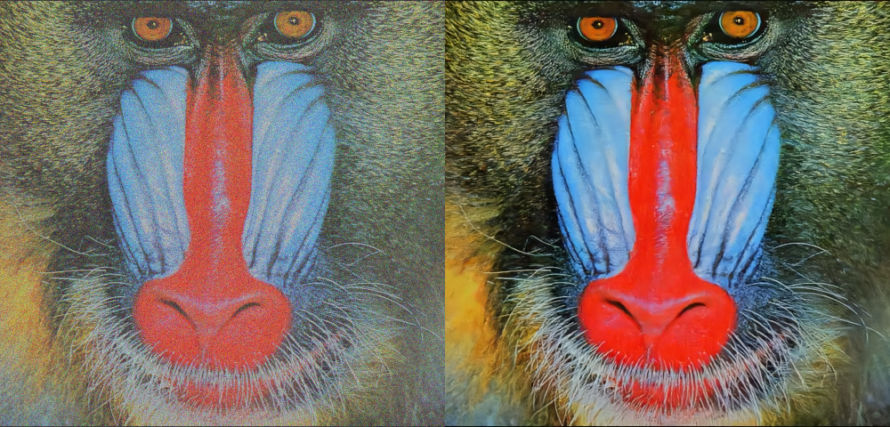
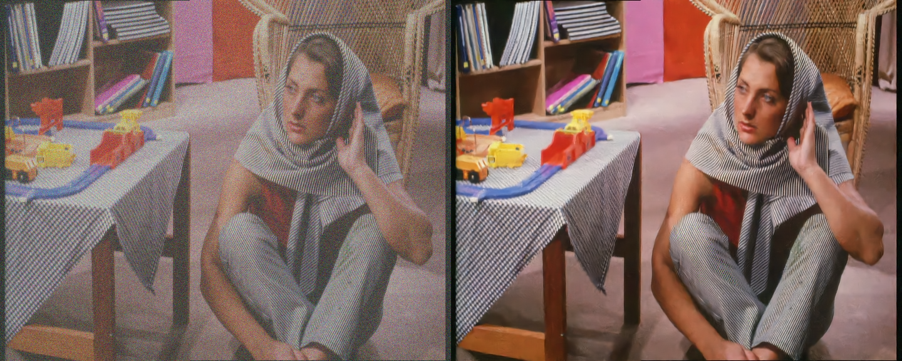
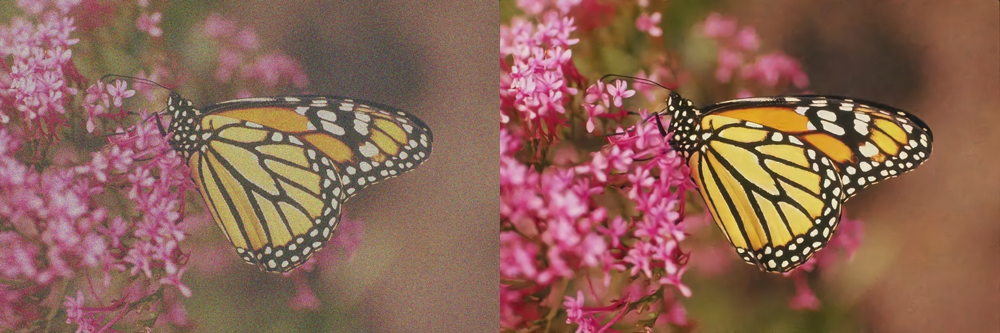

# Learning Deep CNN Denoiser Prior for Image Restoration
# IRCNN-Tensorflow
This is a tensorflow re-implementation of [Learning Deep CNN Denoiser Prior for Image Restoration](http://www4.comp.polyu.edu.hk/%7Ecslzhang/paper/IRCNN_CVPR17.pdf).
***
# Requirements
1. Tensorflow==1.8
2. opencv-python 
***
# Model Architecture

# Training Loss

***
# Results
Sigma = 25

